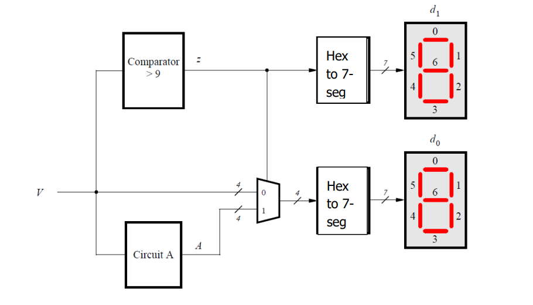

# Part II – Binary to Decimal Conversion with MUX & Comparator

### 🔧 Task

➤ Objective:
You are to design a circuit that converts a four-bit binary number V = v3v2v1v0 into its two-digit decimal equivalent D = d1d0. Table 1 shows the required output values. A partial design of this circuit is given in Figure 1. It includes a comparator that checks when the value of V is greater than 9, and uses the output of this comparator in the control of the 7-segment displays. You are to complete the design of this circuit.

<pre>
v3 v2 v1 v0  d1 d0
0  0  0  0   0  0
0  0  0  1   0  1
0  0  1  0   0  2
… .............. …
1  0  0  1   0  9
1  0  1  0   1  0
1  0  1  1   1  1
1  1  0  0   1  2
1  1  0  1   1  3
1  1  1  0   1  4
1  1  1  1   1  5
Table 1: Binary-to-decimal conversion values.
</pre>

The output z for the comparator circuit can be specified using a single Boolean expression, with the four inputs V3-0. Design this Boolean expression by making a truth table that shows the valuations of the inputs V3-0 for which z has to be 1.

  
   
  <strong>Figure 1:</strong> Partial design of the binary-to-decimal conversion circuit

Notice that the circuit in Figure 1 includes a 4-bit wide 2-to-1 multiplexer. The purpose of this multiplexer is to drive digit d0 with the value of V when z = 0, and the value of A when z = 1. To design circuit A consider the following. For the input values V <= 9, the circuit A does not matter, because the multiplexer in Figure 1 just selects V in these cases. But for the input values V > 9, the multiplexer will select A. Thus, A has to provide output values that properly implement Table 1 when V > 9. You need to design circuit A so that the input V = 1010 gives an output A = 0000, the input V = 1011 gives the output A = 0001, …, and the input V = 1111 gives the output A = 0101. Design circuit A by making a truth table with the inputs V3-0 and the outputs A3-0.

---
  
**Author**      : Sanjida Orin Tawhid  
**Date**        : 30 Jun 2025  
**Project**     : C4M1P2  
**Board**       : DE10-Lite  
**Quartus**     : 16.1 Lite Edition  

## 🔍 Overview

Displays a 4-bit binary value (0–15) as two decimal digits using a comparator, subtractor (`circuitA`), and a 2-to-1 multiplexer. Implements correction when value exceeds 9 (i.e., 10–15).

---

## 🔧 Signal Map

| Signal | Description              |
|--------|--------------------------|
| SW[3:0] | Binary input V          |
| HEX0    | Decimal ones digit      |
| HEX1    | Decimal tens digit      |

| Internal Blocks Used |
|----------------------|
| `comparator_4_bit.vhd` |
| `circuitA.vhd`         |
| `MUX_2_to_1.vhd`       |

---

## 🗂 Files

- `C4M1P2.vhd`
- `comparator_4_bit.vhd`
- `circuitA.vhd`
- `MUX_2_to_1.vhd`

---

## 🧪 Test Examples

| V (SW3–0) | Expected HEX1 HEX0 |
|-----------|---------------------|
| 0101      | 0 5                 |
| 1010      | 1 0                 |
| 1111      | 1 5                 |

---

## 🛠 How to Run

1. Open `C4M1P2.qpf` in Quartus.
2. Compile the project.
3. Load `.sof` into DE10-Lite.
4. Use SW[3:0] to provide input.

---

## Notes

- MUX selects V or A based on Z (V > 9).
- Only concurrent statements used — no IF or CASE.
