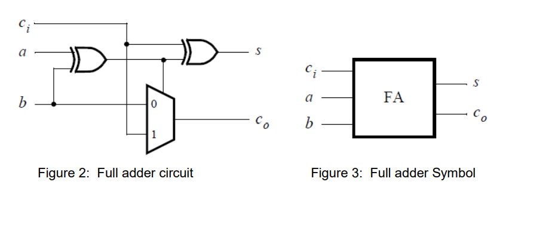

# Part III – 4-Bit Ripple-Carry Adder Using Full Adders

### 🔧 Task
Figure 2 shows a circuit for a full adder, which has the inputs a, b, and ci, and produces the outputs s and co. Figure 3 show a circuit symbol for the full adder with the truth table in Table 2, which produces the two-bit binary sum co s = a + b + ci. Figure 4 shows how four instances of this full adder module can be used to design a circuit that adds two four-bit numbers. This type of circuit is usually called a ripplecarry adder, because of the way that the carry signals are passed from one full adder to the next. Write VHDL code that implements this circuit, as described below.

  
   

  
   

---

**Author**      : Sanjida Orin Tawhid   
**Project**     : C4M1P3  
**Board**       : DE10-Lite  
**Quartus**     : 16.1 Lite Edition  

## 🔍 Overview

Implements a 4-bit ripple-carry adder using 4 chained 1-bit full adders. The inputs are A and B from switches SW7–0 and carry-in from SW8. The sum and carry-out are displayed on red LEDs.

---

## 🔧 Signal Map

| Switch  | Purpose       |
|---------|---------------|
| SW[3:0] | Operand B     |
| SW[7:4] | Operand A     |
| SW[8]   | Carry-in      |

| Output    | Description       |
|-----------|-------------------|
| LEDR[3:0] | 4-bit sum         |
| LEDR[4]   | Carry-out         |

---

## 🗂 Files

- `C4M1P3.vhd`
- `Full_Adder.vhd`

---

## 🧪 Test Cases

| A  | B  | Cin | Sum | Cout | LEDR4–0 |
|----|----|-----|-----|------|---------|
| 4  | 11 | 0   | 16  | 1    | 10000   |
| 15 | 8  | 1   | 23  | 0    | 10111   |

---

## 🛠 How to Run

1. Open `C4M1P3.qpf`.
2. Compile and program to DE10-Lite.
3. Use switches SW8–0 to test adder.

---

## Notes

- Ripple carry via chained full adders.
- Structural VHDL, modular, fully concurrent.
